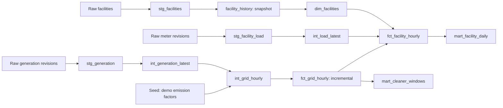

# dbt Energy Analytics

[](https://github.com/UniqueUserNumber/dbt-energy-analytics/actions/workflows/dbt.yml)
[](LICENSE)

**A runnable dbt project for hourly grid carbon intensity and electricity-use analytics.**

An energy analytics project by Michael Maggioli.

**Learning dbt? Start with the [step-by-step course](docs/learning_path.md): ten
lessons with commands, expected results, exercises, and a Fivetran/Snowflake extension.**

How does the electricity mix change through the day? What does that mean for a
facility's estimated emissions? When would a flexible workload encounter a
lower-carbon grid mix?

This project answers those questions with **dbt Core + DuckDB**, original synthetic
data, SQL models, tested metrics, incremental corrections, and SCD Type 2 history.
Run it on your laptop with no warehouse account, API key, or paid service.

All included data and emission factors are synthetic. Results illustrate
**production-based CO2 estimates**, not verified Scope 2 inventories or measured
avoided emissions.

## What you can explore

- **Grid intensity:** hourly fuel mix, estimated direct CO2, and carbon-free generation share.
- **Facility estimates:** electricity use joined to the same region and UTC hour.
- **Daily reporting:** load-weighted intensity, emissions estimates, and data coverage.
- **Cleaner windows:** the best complete three-hour window for a 3 MWh workload,
  compared with starting at 18:00 UTC. This is a retrospective scenario.
- **Changing data:** corrected old readings and a facility ownership change.

The baseline has two synthetic grid regions labeled ISONE and PJM, six fuels,
three fictional facilities, and 72 hours from 2026-01-01 through 2026-01-03 UTC.
The updated scenario adds 2026-01-04 and corrects one earlier grid and meter reading.
These values do not represent measured conditions in those real regions.

## Run it

Install Git and Python **3.12 or 3.13**. Initial dependency installation needs internet.
Run commands from the repository root. The Python loader handles ingestion; dbt
handles transformations after data lands in DuckDB.

### Windows PowerShell

```powershell
git clone https://github.com/UniqueUserNumber/dbt-energy-analytics.git
cd dbt-energy-analytics
python -m venv .venv
.\.venv\Scripts\python.exe -m pip install -r requirements.txt
.\.venv\Scripts\dbt.exe deps --profiles-dir .
.\.venv\Scripts\python.exe scripts/load_demo.py
.\.venv\Scripts\dbt.exe build --profiles-dir .
.\.venv\Scripts\python.exe scripts/query_demo.py
```

These commands do not require changing PowerShell's script execution policy.
To use the shorter commands below in PowerShell, replace `python` with
`.\.venv\Scripts\python.exe` and `dbt` with `.\.venv\Scripts\dbt.exe`.

### macOS / Linux

```bash
git clone https://github.com/UniqueUserNumber/dbt-energy-analytics.git
cd dbt-energy-analytics
python3 -m venv .venv
source .venv/bin/activate
python -m pip install -r requirements.txt
dbt deps --profiles-dir .
python scripts/load_demo.py
dbt build --profiles-dir .
python scripts/query_demo.py
```

Expect **144 grid-hour rows, 216 facility-hour rows, 9 facility-day rows, and 6
cleaner-window rows**. The warehouse is `warehouse/energy.duckdb` and is ignored by Git.
The included `profiles.yml` configures only this local database and contains no credentials.

## See dbt's lineage and documentation

```bash
dbt docs generate --profiles-dir .
dbt docs serve --profiles-dir . --port 8080
```

Open `http://localhost:8080` and explore the lineage graph. Press Ctrl+C to stop.
Each output model has a description and documented columns.



## Run the correction and history demo

Start with the baseline build above, then:

```bash
python scripts/load_demo.py --scenario updated
dbt build --profiles-dir .
python scripts/query_demo.py
```

The grid fact grows from 144 to **192** rows, and the facility fact from 216 to
**288**. The ISONE gas reading at **2026-01-01 18:00 UTC** changes from 620 to 720
MWh, even though the new data arrived days later. The F001 meter for that hour
changes from 1,100 to 1,350 kWh. The grid key is replaced, not duplicated.
F001's owner gets a second snapshot version while the first remains in history.

Re-run the updated load and build: results stay the same. Ingestion is idempotent.
After loading updated data, the loader rejects a backward reset to baseline.
For a new baseline, set `DBT_DUCKDB_PATH` to a new absolute `.duckdb` path before
running both the loader and dbt. No existing warehouse needs to be deleted.

## What this demonstrates about dbt

- `source()` declares landed data and `ref()` expresses model dependencies.
- Views handle staging and deduplication; tables expose business-ready outputs.
- An incremental model uses `delete+insert`, a stable key, and ingestion time
  to incorporate late corrections. Downstream facility tables are rebuilt so
  those corrections propagate.
- A timestamp snapshot keeps SCD2 ownership history.
- A seed holds small reference data, a macro standardizes kWh-to-MWh conversion,
  and `dbt_utils` supplies surrogate keys and reusable tests.
- Generic and singular tests check uniqueness, relationships, ranges, coverage,
  complete fuel mixes, and daily-to-hourly reconciliation.
- GitHub Actions verifies builds on Linux/Python 3.12 and Windows/Python 3.13.

The example optimizes learning and traceability. Its upstream views still scan
the small source history; incremental materialization alone does not make the
whole pipeline incremental or prove production-scale performance.

## Verify the behavior

```bash
python scripts/verify_demo.py
```

This creates a temporary warehouse and checks baseline arithmetic, late updates,
snapshot history, idempotent reruns, and agreement with a full rebuild. It also
introduces missing factors and missing hours and requires the data tests to fail.
Your normal demo warehouse is untouched.

## Build on it

Start with [the step-by-step learning guide](docs/learning_path.md), then read
[the methodology and data contracts](docs/methodology.md).

Good next projects are a real public data adapter, timestamp and DST handling,
hourly consumption-based factors, a small dashboard, and a Snowflake port.
The [contribution guide](CONTRIBUTING.md) explains how to extend the project.
You can fork, adapt, and reuse the code and original synthetic fixtures under
the [MIT license](LICENSE).

### References

- [dbt incremental models](https://docs.getdbt.com/docs/build/incremental-models)
- [dbt snapshots](https://docs.getdbt.com/docs/build/snapshots)
- [dbt-duckdb adapter](https://github.com/duckdb/dbt-duckdb)
